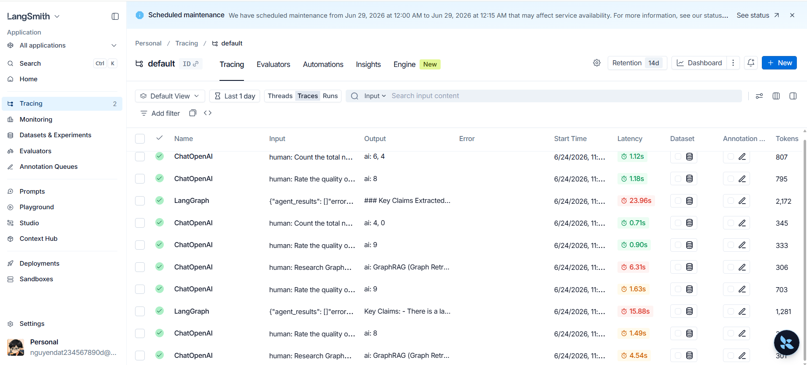

# Deliverables Submission

## 1. Trace Screenshot / Link

## 2. Giải thích Failure Mode và Cách Fix

**Failure Mode (Lỗi đã gặp):**
Trong quá trình chạy Benchmark script, hệ thống báo lỗi `pydantic_core._pydantic_core.ValidationError: 1 validation error for AgentResult`. Cụ thể, trường `agent` chỉ chấp nhận các giá trị `supervisor, researcher, analyst, writer, critic` nhưng `baseline_runner` lại cố gán giá trị `"baseline"`. Điều này xảy ra do mô hình Pydantic định nghĩa một rào cản xác thực dữ liệu (Guardrail) rất chặt chẽ bằng cách sử dụng kiểu `Enum` (AgentName).

**Cách Fix:**
Sửa file `src/multi_agent_research_lab/core/schemas.py` bằng cách thêm trường `BASELINE = "baseline"` vào trong `AgentName(str, Enum)`. Việc này giúp Pydantic schema chấp nhận tên agent là "baseline" cho hàm đánh giá Single-Agent.

## 3. Exit Ticket

**Câu 1: Case nào nên dùng multi-agent? Vì sao?**
Nên dùng multi-agent cho các tác vụ phức tạp, chia thành nhiều bước (multi-step reasoning) và yêu cầu tính chuyên môn hóa ở từng bước (như tìm kiếm -> phân tích -> viết mã/báo cáo). Việc phân chia vai trò (roles) với các system prompt riêng biệt sẽ giúp giảm thiểu rủi ro LLM bị quá tải context (ảo giác) và cho phép thêm các tác vụ đối soát/tự sửa lỗi (ví dụ có thêm Critic Agent).

**Câu 2: Case nào không nên dùng multi-agent? Vì sao?**
Không nên dùng multi-agent cho các tác vụ hỏi đáp cơ bản (Q&A), chuyển ngữ, phân loại văn bản ngắn, hoặc các luồng yêu cầu độ trễ (latency) cực thấp và tiết kiệm chi phí (cost). Multi-agent luôn tốn nhiều thời gian chờ hơn (chạy nhiều lời gọi LLM nối tiếp) và tiêu thụ số lượng input/output tokens nhiều hơn đáng kể, vì vậy không đáng để sử dụng cho các tác vụ đơn giản mà 1 lệnh gọi LLM (Single-agent) đã có thể giải quyết tốt.
